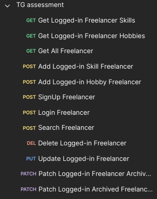
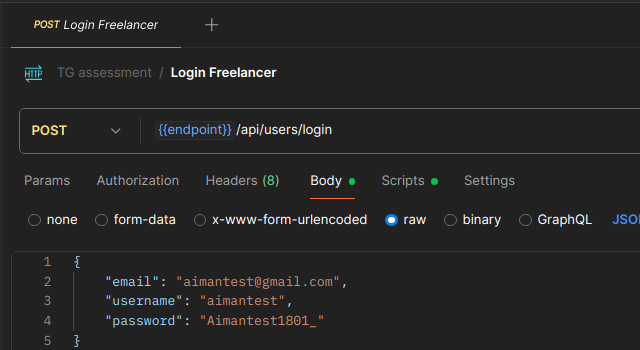
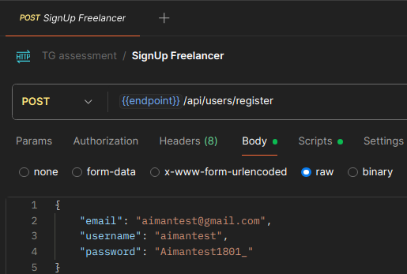
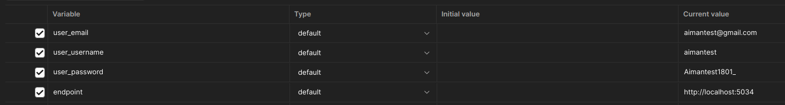
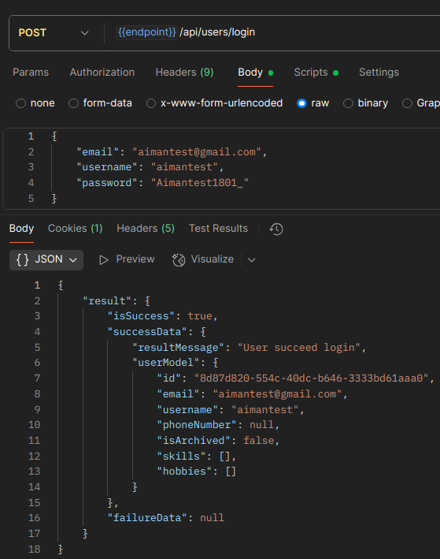
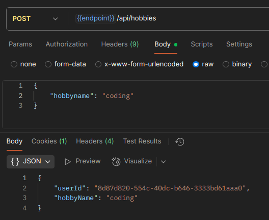
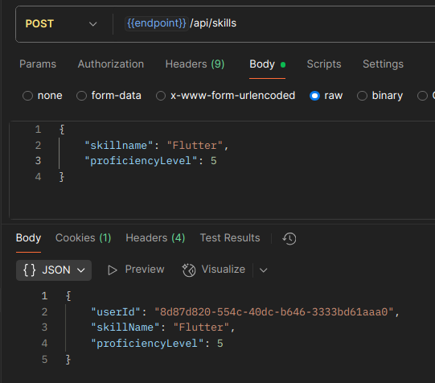
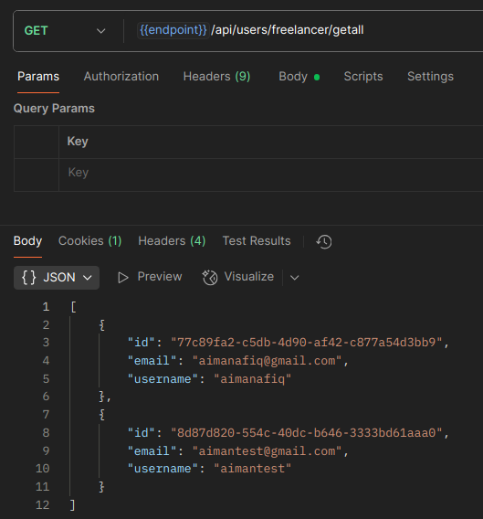
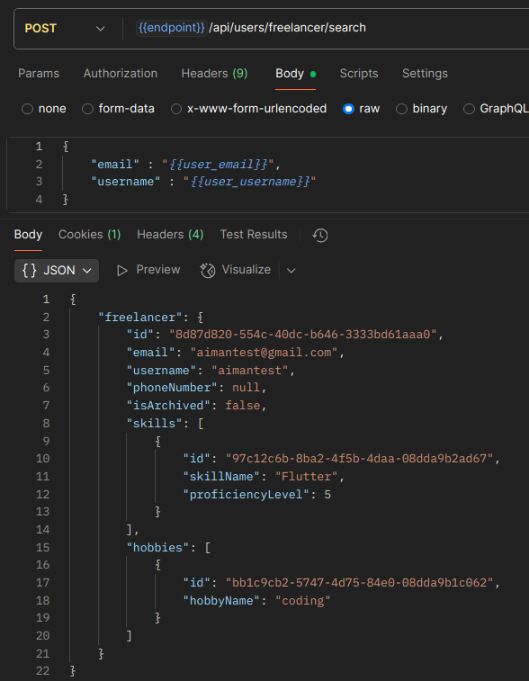

# TG ASPNET CORE ASSESMENT

## Tech Stack

- **ASP.NET Core** 9.0.0
- **C#** 13
- **Docker** 28.0.4

## API ACCESS

- Run in postman desktop application not in web for localhost to work
- [Visit API or clone to your postman](https://www.postman.com/payload-specialist-8137764/workspace/aimanafiq-work-s/collection/33511040-12dfe2a1-28fa-4185-91b0-ca2b0ac421b0?action=share&creator=33511040&active-environment=33511040-98c2213f-076a-4273-8fb1-fa23755ecb0a)

## Postman ENV

- Pick TG Assesment environment
- Sometimes, the {{endpoint}} environment not loaded correctly, but for using docker and MSSQL database both is at localhost:5034

## Important Step

- There are two ways this dotnet app could be run which is docker and using MSSQL database desktop

## Docker [RECOMMENDED]

### [IMPORTANT]

1. Windows setup

- Intall WSL
- Install Docker desktop and run the software

2. Mac setup

- Install Docker desktop and run the software

3. Linux

- Install Docker
- Install Docker Compose V2

You might be able to use the command below for Linux docker compose v2:

```bash
sudo apt install docker-compose-v2
```

- Run docker build command

```bash
docker compose up --build
```

- You should already got the 2 containers and 1 volume

- Check with command

```bash
docker volume ps -a
docker volume ls
```

- Your containers should already started, you can check with below command

```bash
docker ps
```

## MSSQL Database localhost

### [IMPORTANT]

- go to appsettings.Development.json
- for DefaultConnection replace this ONLY if you are using MSSQL Database

- Windows

```bash
"DefaultConnection": "Data Source={replace this with what your OS called in MSSQL};Initial Catalog=tg_assessment;Integrated Security=True;Connect Timeout=30;Encrypt=False;TrustServerCertificate=False;ApplicationIntent=ReadWrite;MultiSubnetFailover=False"
```

- For example my Data Source is LAPTOP-NCFJ1P2M\\SQLEXPRESS, also don't forget to remove {}

- Linux / possibility with Mac also ? unsure.

You actually only need to change Server=localhost but below command if you want to paste everything

```bash
"DefaultConnection": "Server=localhost,1433;Database=tg_assessment;User Id=sa;Password=DockerSQL2022_;Encrypt=True;TrustServerCertificate=True;"
```

1. Install MSSQL database desktop and make a database called

```bash
tg_assessment
```

- Tips
- If you are using Linux and Mac, you need to make container for MSSQL Database
- If you are using Windows, the MSSQL Database is available

2. Add Migrate and run the dotnet application

- In ROOT path

```bash
dotnet restore
cd tg.api
dotnet watch run
```

3. Update the database

```bash
dotnet ef database update
```

## Application Features

<div style="display: flex; justify-content: space-between; align-items: center;">
  
</div>

- These are some of the feature available

<div style="display: flex; justify-content: space-between; align-items: center;">
  
  
</div>



- When you login, or sign up the request is going to fill in in post response for email and username, but for password it will autofill when hit the request

- There are some APIs that you need to go through Sign-Up or Login for it to work which are

1. Delete Freelancer
2. Update Freelancer
3. Archive / Unarchive Freelancer
4. Get All Logged Freelancer Skills
5. Add Logged Freelancer Skills
6. Get All Logged Freelancer Hobbies
7. Add Logged Freelancer Hobbies

Others will work directly

1. Sign up freelancer
2. Login freelancer
3. Search freelancer
4. Get all freelancer

## API Response

- These are the example of the API Response

<div style="display: flex; justify-content: space-between; align-items: center;">
    
    
    
    
    
</div>
